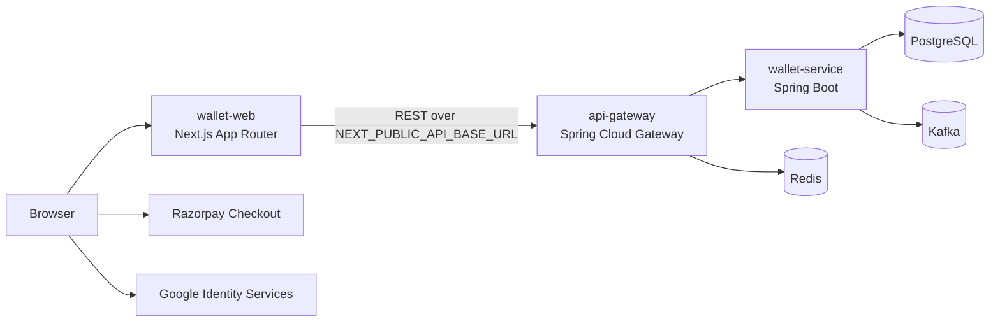

# Wallet Web

Production frontend console for Wallet Platform.

Wallet Web is a Next.js application used by USER and SYSTEM accounts to authenticate, inspect wallet balances, explore ledger entries, create Razorpay payment orders, verify payments, issue SYSTEM bonus credits, inspect Kafka messaging state, and manage account lifecycle operations. It is designed to run behind the Wallet API Gateway and to consume only gateway-exposed APIs.

## Production Scope

| Area | Responsibility |
|---|---|
| Authentication | Email/password login, signup with OTP verification, Google Identity login, refresh-token session restoration, logout, account closure |
| Wallets | USER self-balance view, SYSTEM user-dropdown balance lookup, active assets, total balance, balance records |
| Ledger | USER self-ledger view, SYSTEM user-dropdown ledger lookup, asset-filtered entries, entry detail inspection |
| Payments | USER-only Razorpay order creation and checkout verification, USER/SYSTEM order-status lookup |
| Wallet actions | USER spend flow, SYSTEM bonus issuance, hidden idempotency-key generation |
| Messaging observability | SYSTEM outbox, Kafka audit, and messaging summary dashboards |
| Profile | Non-sensitive identity display and USER-only close-account action |
| Security UX | Owner-type aware navigation, page gating, token persistence, refresh-on-boot and refresh-on-401 |

## Architecture Position



The frontend never calls `wallet-service` directly. All API traffic must go through `api-gateway`.

## Repository Layout

```text
wallet-web/
├── Dockerfile
├── next.config.ts
├── package.json
├── tsconfig.json
├── src/
│   ├── app/
│   │   ├── dashboard/
│   │   ├── ledger/
│   │   ├── login/
│   │   ├── payments/
│   │   ├── profile/
│   │   ├── wallet-actions/
│   │   └── wallets/
│   ├── components/
│   │   ├── layout/
│   │   └── ui/
│   ├── features/
│   │   ├── auth/
│   │   ├── ledger/
│   │   ├── messaging/
│   │   ├── payments/
│   │   ├── profile/
│   │   ├── users/
│   │   ├── wallet-actions/
│   │   └── wallets/
│   └── lib/
└── docs/
```

## Runtime Contract

| Variable | Required | Build-time or runtime | Purpose |
|---|---:|---|---|
| `NEXT_PUBLIC_API_BASE_URL` | Yes | Build-time for browser bundle | Public gateway base URL |
| `NEXT_PUBLIC_GOOGLE_CLIENT_ID` | Yes when Google login is enabled | Build-time | Google OAuth web client ID |
| `NEXT_PUBLIC_RAZORPAY_KEY_ID` | Yes when backend does not return keyId | Build-time | Razorpay Checkout public key |
| `NODE_ENV` | Yes | Runtime | `production` for deployed build |
| `NEXT_TELEMETRY_DISABLED` | Recommended | Runtime | Disable Next telemetry in containers |

`NEXT_PUBLIC_*` values are embedded into the browser bundle during `next build`. Rebuild the image when these values change.

## Production Build

```bash
npm ci
npm run build
npm run start
```

## Docker Build

```bash
docker build \
  --build-arg NEXT_PUBLIC_API_BASE_URL=https://api.example.com \
  --build-arg NEXT_PUBLIC_GOOGLE_CLIENT_ID=<google-client-id>.apps.googleusercontent.com \
  --build-arg NEXT_PUBLIC_RAZORPAY_KEY_ID=<razorpay-key-id> \
  -t wallet-web:latest .
```

## Local Orchestration

`wallet-web` owns its `Dockerfile`. `wallet-local-infra` owns orchestration.

```text
wallet-service/
  Dockerfile

api-gateway/
  Dockerfile

wallet-web/
  Dockerfile

wallet-local-infra/
  docker-compose.yml
```

Example compose service:

```yaml
wallet-web:
  build:
    context: ../wallet-web
    dockerfile: Dockerfile
    args:
      NEXT_PUBLIC_API_BASE_URL: http://localhost:8080
      NEXT_PUBLIC_GOOGLE_CLIENT_ID: ${NEXT_PUBLIC_GOOGLE_CLIENT_ID}
      NEXT_PUBLIC_RAZORPAY_KEY_ID: ${NEXT_PUBLIC_RAZORPAY_KEY_ID}
  container_name: wallet-web
  ports:
    - "3000:3000"
  depends_on:
    - api-gateway
  networks:
    - wallet-network
```

## User Access Model

| Owner type | Wallet balance | Ledger | Spend | Bonus | Create payment order | Check payment status | Messaging admin | Close account |
|---|---|---|---|---|---|---|---|---|
| `USER` | Own account only | Own account only | Enabled | Hidden/blocked | Enabled | Enabled | Hidden/blocked | Enabled |
| `SYSTEM` | Dropdown user lookup | Dropdown user lookup | Hidden/blocked | Enabled | Hidden/blocked | Enabled | Enabled | Hidden/blocked |

The frontend gating is UX only. Backend and gateway authorization remain the security source of truth.

## Core API Dependencies

| Feature | Endpoint |
|---|---|
| Signup | `POST /api/v1/auth/signup` |
| Verify OTP | `POST /api/v1/auth/verify-otp` |
| Login | `POST /api/v1/auth/login` |
| Google login | `POST /api/v1/auth/google` |
| Refresh token | `POST /api/v1/auth/refresh-token` |
| Logout | `POST /api/v1/auth/logout` |
| Close account | `DELETE /api/v1/auth/close-account` |
| User options | `GET /api/v1/admin/users/options` |
| Wallet balances | `GET /api/v1/wallets/{userId}/balance` |
| Ledger | `GET /api/v1/wallets/{userId}/ledger?assetCode=GOLD` |
| Spend | `POST /api/v1/wallets/spend` |
| Bonus | `POST /api/v1/wallets/bonus` |
| Create payment order | `POST /api/v1/payments/create-order` |
| Verify payment | `POST /api/v1/payments/verify` |
| Order status | `GET /api/v1/payments/order-status/{orderId}` |
| Messaging summary | `GET /api/v1/admin/messaging/summary` |
| Outbox events | `GET /api/v1/admin/messaging/outbox-events` |
| Kafka audit events | `GET /api/v1/admin/messaging/kafka-audit-events` |

## Release Checklist

| Check | Required state |
|---|---|
| TypeScript | `npm run build` passes |
| Environment | Production gateway URL configured in `NEXT_PUBLIC_API_BASE_URL` |
| Google OAuth | Authorized JavaScript origin matches production frontend origin |
| Razorpay | Public key configured, backend secret and webhook secret configured in backend |
| CORS | Gateway allows production frontend origin |
| Auth | Access token refresh works after browser reload |
| USER flow | Signup, OTP, login, wallet, ledger, payment, spend, profile close-account tested |
| SYSTEM flow | Login, user dropdown, wallets, ledger, bonus, messaging dashboard tested |
| Docker | Image builds without dev-only dependencies leaking into runtime |
| Observability | Gateway/backend logs and metrics available during smoke test |

## Documentation Index

| Topic | File |
|---|---|
| System architecture | [`docs/architecture.md`](wallet-web-docs-output/docs/architecture.md) |
| Frontend application architecture | [`docs/frontend-architecture.md`](wallet-web-docs-output/docs/frontend-architecture.md) |
| Authentication and session persistence | [`docs/auth-session.md`](wallet-web-docs-output/docs/auth-session.md) |
| Owner type and authorization UX | [`docs/access-control.md`](wallet-web-docs-output/docs/access-control.md) |
| Wallet and ledger UX contracts | [`docs/wallets-ledger.md`](wallet-web-docs-output/docs/wallets-ledger.md) |
| Payments and Razorpay checkout | [`docs/payments.md`](wallet-web-docs-output/docs/payments.md) |
| SYSTEM bonus and wallet actions | [`docs/wallet-actions.md`](wallet-web-docs-output/docs/wallet-actions.md) |
| Kafka messaging dashboard | [`docs/messaging-observability.md`](wallet-web-docs-output/docs/messaging-observability.md) |
| Profile and account closure | [`docs/profile-account-closure.md`](wallet-web-docs-output/docs/profile-account-closure.md) |
| Environment and configuration | [`docs/environment.md`](wallet-web-docs-output/docs/environment.md) |
| Docker and compose integration | [`docs/docker.md`](wallet-web-docs-output/docs/docker.md) |
| Deployment strategy | [`docs/deployment.md`](wallet-web-docs-output/docs/deployment.md) |
| Free deployment alternatives | [`docs/free-deployment-alternatives.md`](wallet-web-docs-output/docs/free-deployment-alternatives.md) |
| Security considerations | [`docs/security.md`](wallet-web-docs-output/docs/security.md) |
| Operations runbook | [`docs/operations-runbook.md`](wallet-web-docs-output/docs/operations-runbook.md) |
| Release checklist | [`docs/release-checklist.md`](wallet-web-docs-output/docs/release-checklist.md) |
