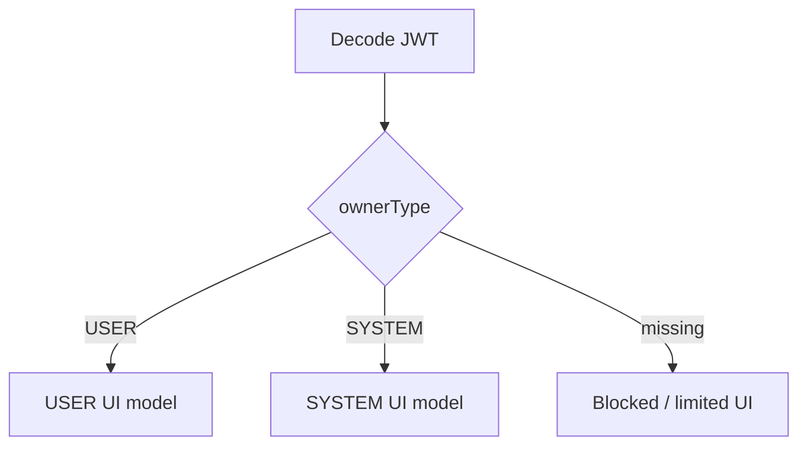

# Owner Type and Authorization UX

Wallet Web uses `ownerType` from the JWT to decide which workflows are visible.

## Owner Types

| ownerType | Meaning |
|---|---|
| `USER` | Normal user account that owns wallets and can spend or create payment orders |
| `SYSTEM` | Operational account that can issue bonus credits, inspect users, and view messaging observability |

## UX Matrix

| Feature | USER | SYSTEM |
|---|---:|---:|
| Own wallet balance | Yes | No |
| User dropdown wallet lookup | No | Yes |
| Own ledger | Yes | No |
| User dropdown ledger lookup | No | Yes |
| Spend wallet credits | Yes | No |
| Issue bonus | No | Yes |
| Create Razorpay order | Yes | No |
| Check order status | Yes | Yes |
| Messaging dashboard | No | Yes |
| Close account | Yes | No |

## Page Gating Flow



## Display Identity Rule

The UI displays:

```text
LDAP = email string before @
```

or the full email when LDAP is unavailable.

The UI does not display UUID user IDs. UUIDs remain internal for backend requests.

## Security Boundary

Frontend gating is not authorization. Backend and gateway must enforce the same owner-type rules. The UI exists to prevent invalid actions and improve operator clarity.
