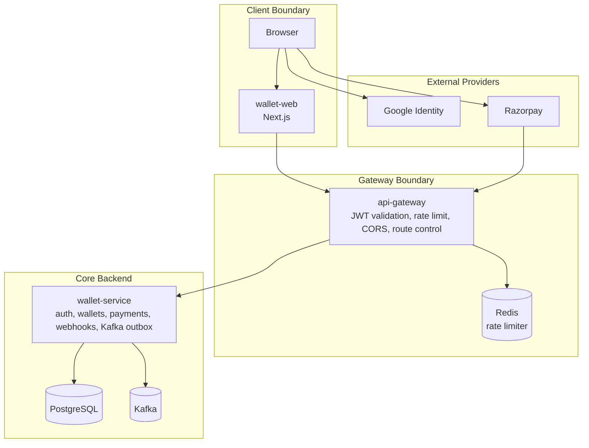
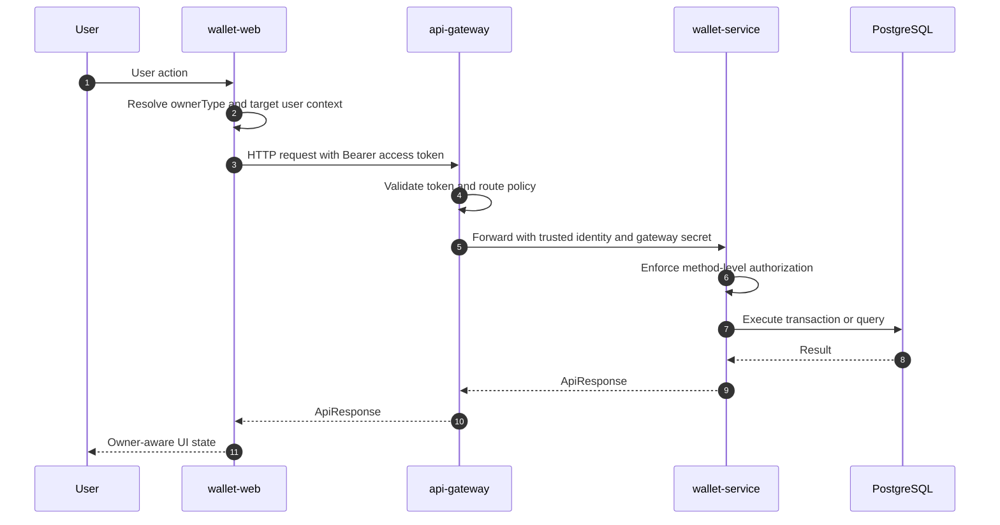

# System Architecture

Wallet Web is the browser-facing console of Wallet Platform. It is not a standalone financial system. It is a controlled user interface over backend contracts exposed by the API Gateway.

## System Boundary

## Request Path

## Design Principles

| Principle | Implementation |
|---|---|
| Gateway-first communication | Browser calls the gateway only. The service remains internal. |
| Owner-aware UI | USER and SYSTEM accounts receive different visible workflows. |
| No sensitive identifier exposure | UUID user IDs are kept internal. UI displays email or LDAP. |
| Backend-owned security | Frontend gating prevents wrong UX, not unauthorized access. |
| Contract-driven screens | Each page mirrors exact backend response shapes. |
| Recoverable sessions | Refresh token restores sessions on boot and after access-token expiry. |
| Deterministic financial UX | Idempotency keys are generated internally, not manually edited. |

## Page-to-Domain Mapping

| Route | Domain |
|---|---|
| `/login` | Auth, OTP, Google Identity |
| `/dashboard` | Operational landing page |
| `/wallets` | Multi-asset balance projection |
| `/ledger` | Immutable ledger entry exploration |
| `/payments` | Razorpay order creation, checkout verification, order status |
| `/wallet-actions` | Spend and SYSTEM bonus operations |
| `/admin/messaging` | Kafka outbox and audit observability |
| `/profile` | Account identity and close-account flow |

## Trade-offs

| Decision | Benefit | Cost |
|---|---|---|
| API gateway as only backend origin | Stronger backend isolation and centralized token validation | Local development requires correct gateway configuration |
| Client-side role/owner gating | Clearer UX and fewer invalid user actions | Must not be treated as security enforcement |
| Next.js client-heavy console | Faster operational iteration and rich dashboard behavior | Browser bundle contains public runtime configuration |
| Local Docker orchestration outside app repos | Clean repo ownership and repeatable multi-service stack | Compose paths depend on sibling repository layout |
