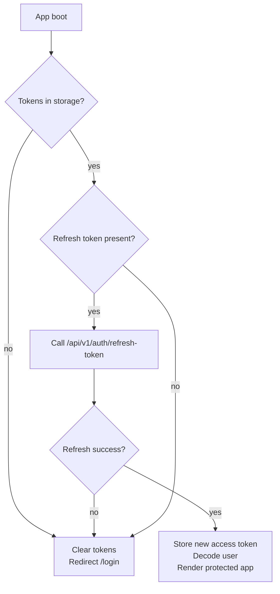
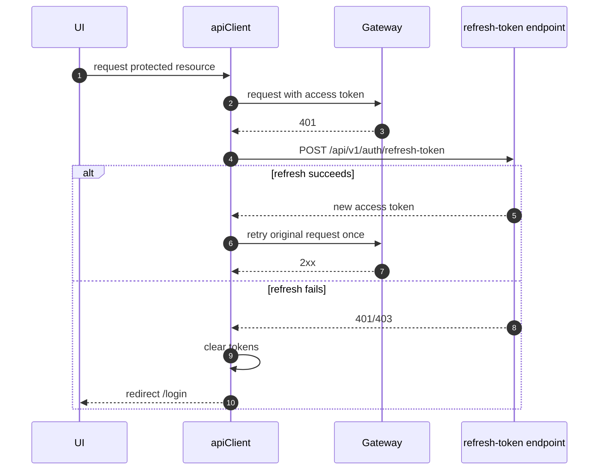
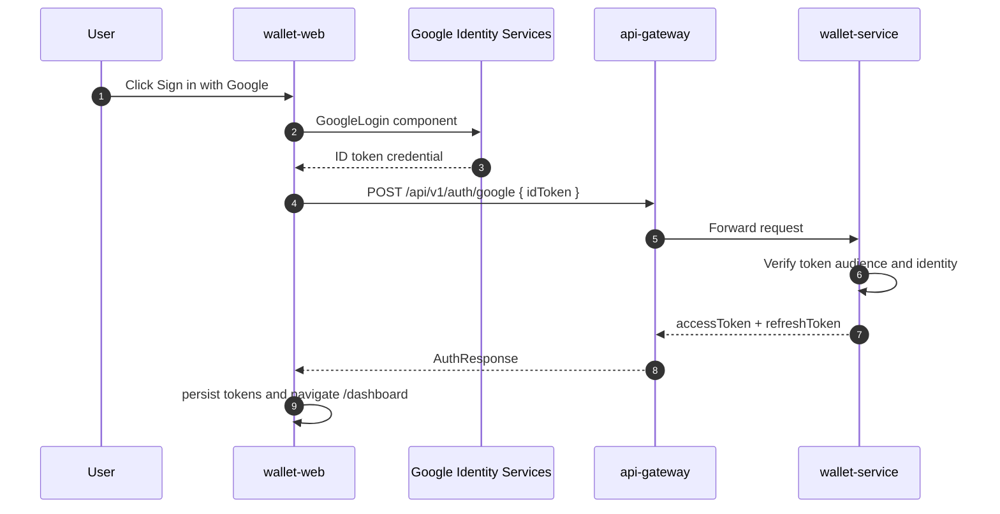

# Authentication and Session Persistence

Wallet Web supports email/password login, signup with OTP verification, Google Identity login, access-token persistence, refresh-token restoration, and logout.

## Auth Token Payload

The access token is decoded into a UI-safe projection.

```json
{
  "sub": "5e23b834-774b-4dba-a778-e52b306832ce",
  "email": "something@gmail.com",
  "ownerType": "SYSTEM",
  "iat": 1783262251,
  "exp": 1783263151
}
```

Frontend projection:

| Claim              | UI field                         |
|--------------------|----------------------------------|
| `sub`              | internal `userId` fallback       |
| `email`            | visible account email            |
| `email` before `@` | visible LDAP                     |
| `ownerType`        | access model: `USER` or `SYSTEM` |
| `exp`              | access-token expiry check        |

## Session Boot Flow



The refresh token is treated as the real session authority. A corrupted, expired, or revoked refresh token clears the session even if the previous access token has not expired.

## Refresh-on-401 Flow



## Google Auth Flow



## Deprecated OAuth Success Endpoint

`POST /api/v1/auth/oauth2/success` is not used by Wallet Web. The active frontend flow uses Google Identity Services and `POST /api/v1/auth/google`.

The deprecated endpoint can remain available temporarily for legacy backend-managed OAuth2 redirect experiments, but it is not part of the production frontend integration.

## Storage Risk

Access and refresh tokens are currently stored in `localStorage`. This is practical for this console but has XSS exposure risk. Production hardening options:

| Option                                           | Trade-off                                                         |
|--------------------------------------------------|-------------------------------------------------------------------|
| `localStorage`                                   | Simple, survives reloads, exposed to XSS                          |
| HttpOnly secure cookie                           | Better token protection, requires backend/gateway cookie strategy |
| In-memory access token + HttpOnly refresh cookie | Stronger browser posture, more implementation complexity          |
