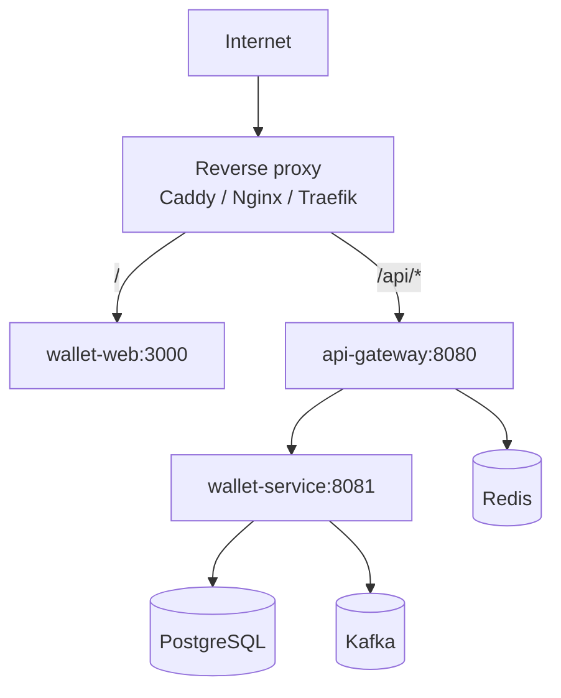

# Deployment Strategy

Wallet Web can be deployed as a standalone frontend container or as part of a single VM-based Docker Compose deployment with gateway and backend services.

## Preferred Deployment Topology for Current Project

## Why Single-VM Compose Is Practical for This Stage

| Reason | Effect |
|---|---|
| Multiple repos need private interservice calls | Docker network gives stable internal DNS |
| Backend and gateway need more than 512 MB headroom | VM memory can be allocated across containers |
| Kafka/Postgres/Redis are easier to wire locally | Compose gives predictable local and production-like topology |
| Render-style external service calls add latency | Internal bridge network avoids public round trips |

## Production Deployment Steps

1. Build and push images, or build on the VM from each repository.
2. Configure DNS for frontend and API gateway.
3. Configure reverse proxy TLS.
4. Set production environment variables.
5. Start infrastructure through compose.
6. Run smoke tests.
7. Verify Google origin, Razorpay checkout, gateway CORS, and auth refresh.

## Smoke Test Matrix

| Test | Expected result |
|---|---|
| Open frontend | UI loads over HTTPS |
| Login USER | Session persists after reload |
| Login SYSTEM | SYSTEM-only pages appear |
| Wallet balance | USER sees own account; SYSTEM sees dropdown |
| Ledger | Asset-filtered entries load |
| Payment order | USER can create order and enter checkout |
| Order status | USER/SYSTEM can query status |
| Bonus | SYSTEM can issue bonus to selected USER |
| Messaging | SYSTEM can load outbox and Kafka audit |
| Close account | USER-only profile action appears |
