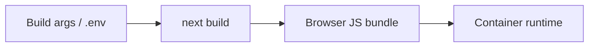

# Environment and Configuration

Wallet Web is configured through build-time public environment variables and runtime container flags.

## Required Variables

| Variable | Example | Purpose |
|---|---|---|
| `NEXT_PUBLIC_API_BASE_URL` | `https://api.example.com` | Public API Gateway URL |
| `NEXT_PUBLIC_GOOGLE_CLIENT_ID` | `xxx.apps.googleusercontent.com` | Google Identity Services web client ID |
| `NEXT_PUBLIC_RAZORPAY_KEY_ID` | `rzp_test_xxx` | Razorpay Checkout key if backend response does not include `keyId` |

## Build-Time Behavior

Next.js embeds `NEXT_PUBLIC_*` variables into the browser bundle during build.



Changing `NEXT_PUBLIC_API_BASE_URL`, Google client ID, or Razorpay key requires rebuilding the image.

## Local `.env.local`

```env
NEXT_PUBLIC_API_BASE_URL=http://localhost:8080
NEXT_PUBLIC_GOOGLE_CLIENT_ID=<google-client-id>.apps.googleusercontent.com
NEXT_PUBLIC_RAZORPAY_KEY_ID=<razorpay-key-id>
```

Restart `npm run dev` after changing `.env.local`.

## Production Origin Checks

| Provider | Required production configuration |
|---|---|
| Google | Authorized JavaScript origin must equal frontend origin, for example `https://wallet.example.com` |
| Razorpay | Public key must match backend Razorpay environment |
| Gateway CORS | Production frontend origin must be allowed |
| Backend JWT | Token must include `sub`, `email`, `ownerType`, `iat`, `exp` |
