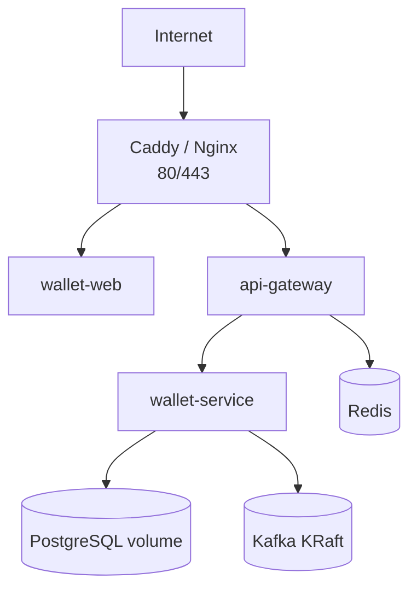

# Free Deployment Alternatives

This project needs more than a simple static frontend host because it includes:

- `wallet-web`
- `api-gateway`
- `wallet-service`
- PostgreSQL
- Redis
- Kafka
- optional Prometheus/Grafana/Tempo stack

The practical no-cost target for deploying the whole stack is a free VM where Docker Compose can run all services on one private network.

## Recommended No-Cost Target: Oracle Cloud Always Free VM

Oracle Cloud Free Tier includes Always Free services and lists Arm-based Ampere A1 Compute as an Always Free service. It also states that Always Free services are available for an unlimited time, subject to limits and capacity.

Reference: https://www.oracle.com/cloud/free/

### Why it fits this project

| Requirement | Fit |
|---|---|
| Multiple Docker services | Yes, deploy using Docker Compose on one VM |
| Internal service-to-service networking | Yes, Docker bridge network |
| More memory than Render free containers | Better fit when an Ampere A1 Always Free shape is available |
| No public round trips between gateway and service | Yes, `api-gateway -> wallet-service` over internal Docker DNS |
| Port control | Reverse proxy can expose only 80/443 |
| Kafka possible | Yes for demo/staging-scale Kafka, with memory tuning |

### Suggested VM Layout



### Operational cautions

| Caution | Handling |
|---|---|
| Regional capacity can be unavailable | Try another region or retry later |
| ARM CPU architecture | Build multi-arch Docker images or build directly on the VM |
| Free account verification requires card identity verification | Avoid enabling paid resources and set budget alerts where available |
| Kafka memory usage | Use a single-broker KRaft setup for demo deployment |
| Database durability | Attach persistent volume and schedule backups |

## Secondary Option: Google Cloud Run Free Tier for Stateless Services

Google Cloud Run pricing includes a monthly free tier for CPU, RAM, and requests. It also documents no charge for data transfer between Cloud Run services in the same region.

Reference: https://cloud.google.com/run/pricing

### Fit

| Requirement | Fit |
|---|---|
| Deploy `wallet-web`, gateway, and service as containers | Possible |
| Scale to zero | Possible |
| Managed HTTPS | Yes |
| Internal service calls | Same-region service-to-service can avoid data-transfer cost |
| Kafka/Postgres/Redis in same environment | Not a full fit; requires managed/external services or separate VM |

Cloud Run is useful for stateless services but not the cleanest no-cost full-stack target when Kafka, Postgres, and Redis are part of the same deployment.

## Not Recommended as Free Targets for This Stack

| Platform | Reason |
|---|---|
| Render free web services | Memory and networking constraints already hurt this architecture |
| Fly.io | Current public pricing emphasizes paid usage; legacy free allowances are not generally available to new users |
| Koyeb | Current public pricing emphasizes paid plans and usage-based compute; not a clean no-cost full-stack answer |
| Vercel-only | Good for frontend, not enough for gateway/service/Kafka/Postgres together |
| GitHub Pages | Static hosting only; not suitable for Next server runtime and backend stack |

## Deployment Recommendation

Use Oracle Cloud Always Free VM for the current product deployment attempt.

Target shape:

```text
Single VM
Docker Compose
Reverse proxy with HTTPS
wallet-web + api-gateway + wallet-service
PostgreSQL + Redis + single Kafka broker
Optional observability stack if memory allows
```

This keeps interservice calls private, avoids external gateway-to-service latency, removes Render port limitations, and gives more control over memory allocation.
