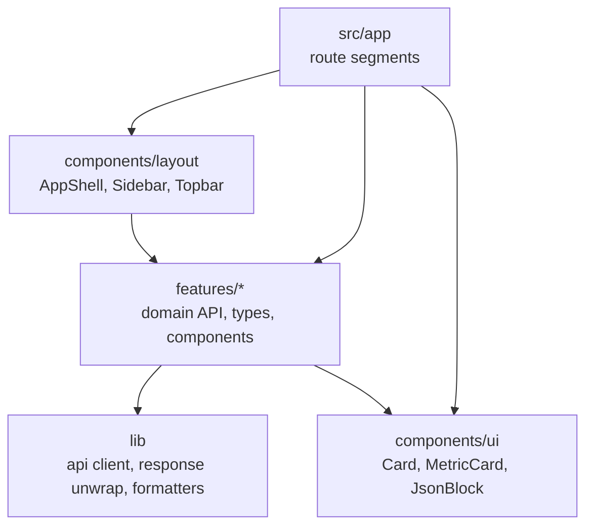
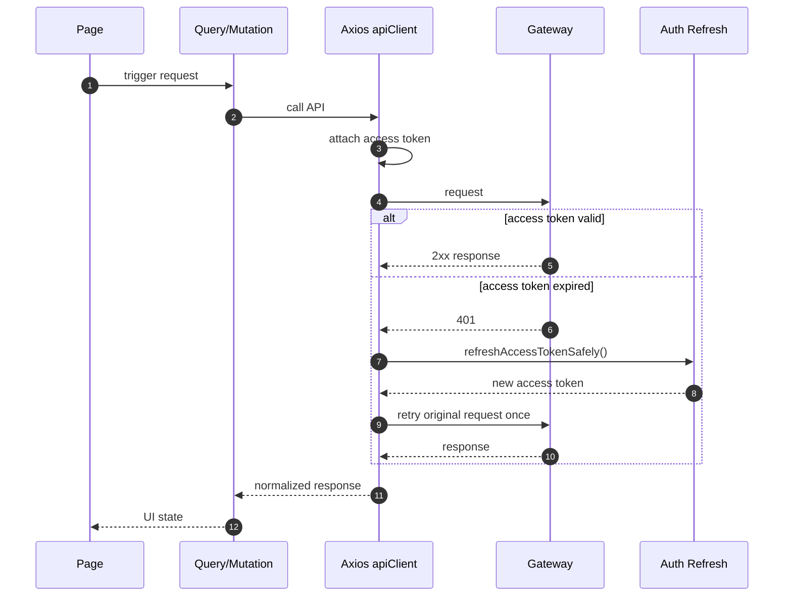

# Frontend Application Architecture

Wallet Web uses feature-based organization. Each domain owns API calls, types, and page-specific UI components.

## Layering

## Feature Modules

| Module | Responsibility |
|---|---|
| `features/auth` | Token storage, JWT decoding, auth provider, protected route, Google auth button |
| `features/users` | SYSTEM user option dropdown for wallets, ledger, and bonus flows |
| `features/wallets` | Balance API, normalization, summary cards, records table, details panel |
| `features/ledger` | Asset-filtered ledger API, table, entry details |
| `features/payments` | Razorpay script loading, order creation, verification, status checks |
| `features/wallet-actions` | Spend and bonus request contracts |
| `features/messaging` | Outbox and Kafka audit dashboards |
| `features/profile` | Close-account API |

## State Categories

| State | Storage |
|---|---|
| Access token | `localStorage` |
| Refresh token | `localStorage` |
| Authenticated user projection | React context from decoded JWT |
| Server data | TanStack Query |
| Form transitions | Local component state |
| Payment phase | Explicit component state: `CREATE_ORDER` or `PAY_VERIFY` |

## API Client Flow

## Component Rules

| Rule | Rationale |
|---|---|
| Keep user UUID internal | Avoid leaking implementation identifiers in UI |
| Use reusable `UserOptionSelect` | Prevent duplicate SYSTEM dropdown logic |
| Hide SYSTEM-only cards from USER | Reduce confusion and accidental invalid actions |
| Hide USER-only cards from SYSTEM | Keep operational flows aligned with backend authorization |
| Never expose idempotency key fields | Idempotency is a system concern, not an operator field |
| Normalize API responses near API module | Page components stay aligned to domain objects |
