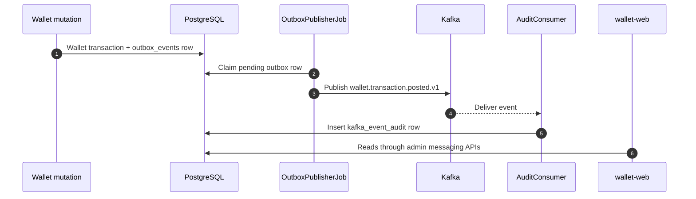

# Kafka Messaging Observability

Wallet Web includes SYSTEM-only screens for Kafka outbox and audit observability.

## Backend Concepts Displayed

| Concept | Meaning |
|---|---|
| Transactional outbox | Durable database row created in the same transaction as wallet mutation |
| Outbox publisher | Scheduled publisher that sends committed outbox events to Kafka |
| Kafka audit consumer | Consumer that persists received wallet transaction events for traceability |
| Messaging summary | Operational summary of outbox and audit states |

## Event Flow

## UI Pages

| Page | Purpose |
|---|---|
| `/admin/messaging` | Summary dashboard |
| `/admin/messaging/outbox` | Outbox event list and details |
| `/admin/messaging/kafka-audit` | Consumed Kafka audit event list and details |

## Operational Value

| Question | Screen |
|---|---|
| Are wallet events being produced? | Outbox events |
| Are events stuck in pending or failed state? | Outbox event status filters |
| Are Kafka events being consumed? | Kafka audit events |
| Did payload serialization produce clean JSON? | Event detail panel |
| Is retry/dead-letter behavior visible? | Outbox detail panel |
