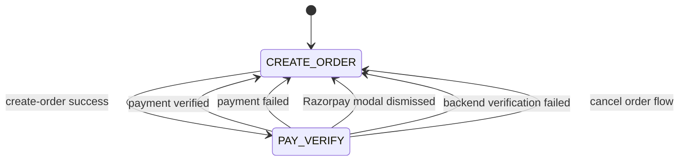
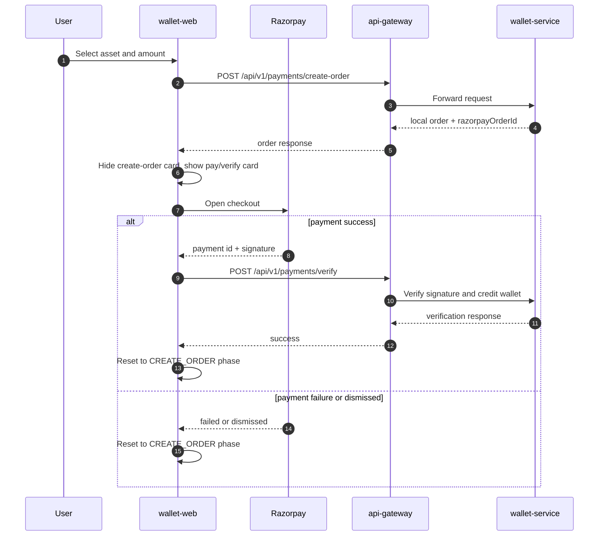

# Payments and Razorpay Checkout

Payments are USER-only for order creation and checkout. USER and SYSTEM accounts can check order status.

## Access Rules

| Action | USER | SYSTEM |
|---|---:|---:|
| Create payment order | Yes | No |
| Pay and verify | Yes | No |
| Check order status | Yes | Yes |

## Payment UI State Machine

## Checkout Flow

## Asset Rules

| Asset | Payment order creation |
|---|---:|
| GOLD | Enabled |
| DIAMOND | Enabled |
| LOYALTY | Disabled; reward-only asset |

## Razorpay Webhook

`POST /api/v1/webhooks/razorpay` is not called by Wallet Web. Razorpay calls this endpoint server-to-server using the configured webhook URL and `X-Razorpay-Signature` header.

Frontend verification gives immediate UX feedback. Webhook reconciliation protects against browser crashes, network failures, and late payment events.

## Failure Handling

| Failure | UI behavior |
|---|---|
| Create order fails | Stay in CREATE_ORDER phase and show error |
| Payment modal dismissed | Reset to CREATE_ORDER phase |
| Payment failed event | Reset to CREATE_ORDER phase |
| Verification API fails | Reset to CREATE_ORDER phase and show error |
| Verification succeeds | Reset to CREATE_ORDER phase and show latest verification state |
