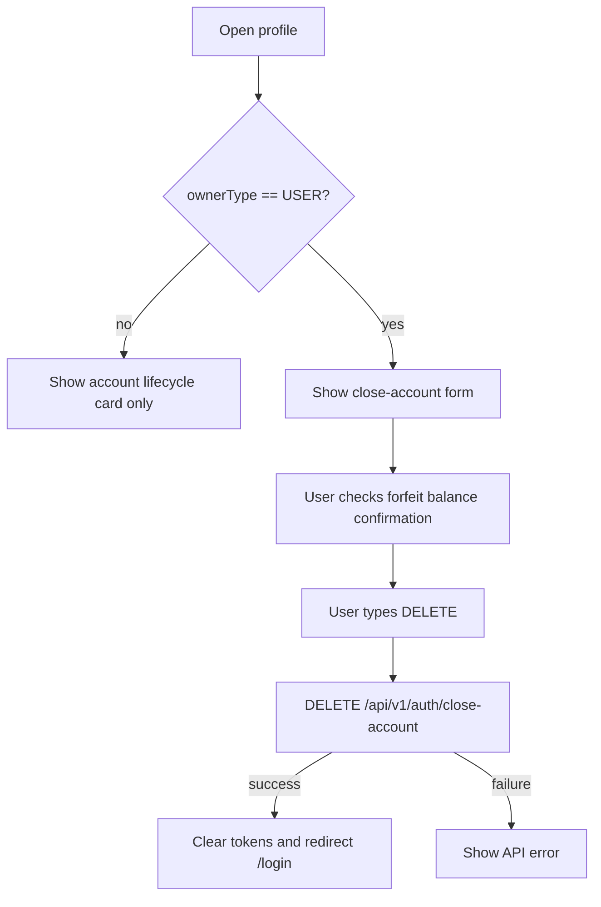

# Profile and Account Closure

The profile page displays non-sensitive identity information and allows USER accounts to close their own account.

## Displayed Identity

| Field | Display |
|---|---|
| LDAP | Email string before `@` |
| Email | Account email |
| Owner Type | `USER` or `SYSTEM` |
| User ID | Hidden |

## Close Account API

```http
DELETE /api/v1/auth/close-account
Content-Type: application/json

{
  "confirmForfeitBalance": true
}
```

Axios uses `data` for DELETE request bodies.

```ts
apiClient.delete("/api/v1/auth/close-account", {
  data: {
    confirmForfeitBalance: true,
  },
});
```

## UX Rules

| Owner type | Close account button |
|---|---:|
| USER | Visible |
| SYSTEM | Hidden/blocked |

## Confirmation Flow



Backend remains responsible for preventing SYSTEM account closure through this endpoint.
