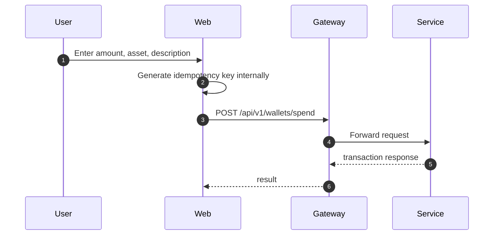
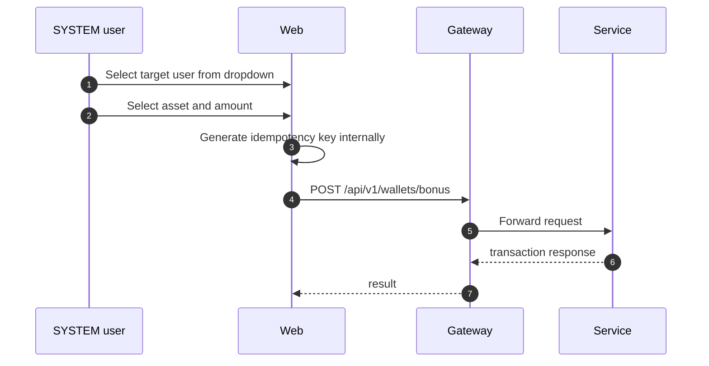

# Wallet Actions

Wallet actions expose spend and SYSTEM bonus workflows.

## Access Rules

| Action | USER | SYSTEM |
|---|---:|---:|
| Spend credits | Yes | No |
| Issue bonus | No | Yes |

## Spend Flow



Spend asset dropdown contains only:

```text
GOLD
DIAMOND
```

LOYALTY is excluded from spend UI.

## Bonus Flow



Bonus asset dropdown contains:

```text
GOLD
DIAMOND
LOYALTY
```

## Idempotency Rule

Idempotency keys are generated by the UI and hidden from the user. Manual editing is intentionally removed to avoid accidental duplicate-key misuse and operator confusion.
