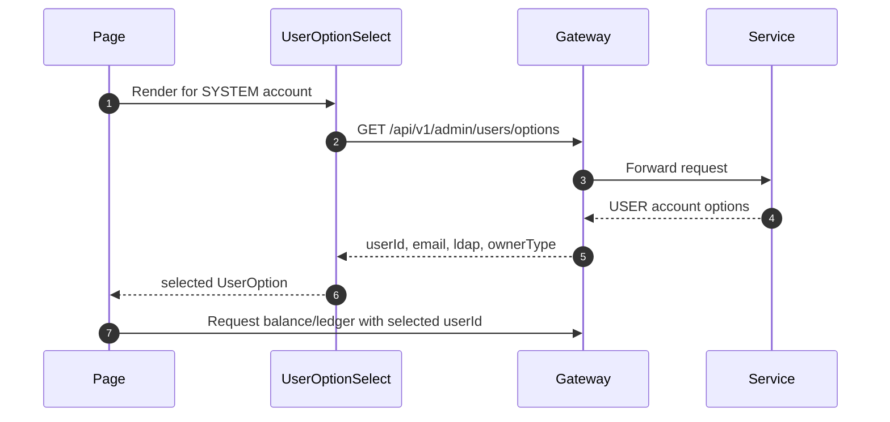

# Wallets and Ledger UX Contracts

## Balance API

Endpoint:

```http
GET /api/v1/wallets/{userId}/balance
```

Response:

```json
{
  "data": {
    "userId": "de8e9ca5-607d-4c87-8772-636b48673f94",
    "wallets": [
      {
        "assetCode": "LOYALTY",
        "assetName": "Loyalty Points",
        "balance": 1098,
        "walletId": 860836359529890400
      }
    ]
  },
  "message": null,
  "success": true
}
```

## Wallet Page Rules

| Owner type | Lookup behavior |
|---|---|
| USER | Non-editable current account LDAP/email. Uses current token user id internally. |
| SYSTEM | Dropdown of existing USER accounts by LDAP/email. Uses selected user id internally. |

Displayed summary:

| Metric | Computation |
|---|---|
| Active assets | `wallets.length` |
| Total balance | Sum of `balance` across returned wallets |
| Balance cards | One card per `assetCode` / `assetName` |
| Balance records | Table containing asset code, asset name, balance, wallet id |

## Ledger API

Endpoint:

```http
GET /api/v1/wallets/{userId}/ledger?assetCode=GOLD
```

Response:

```json
{
  "success": true,
  "message": "Operation successful",
  "data": [
    {
      "entryId": 100,
      "transactionId": 50,
      "transactionType": "SPEND",
      "entryType": "DEBIT",
      "amount": 10,
      "balanceAfter": 90,
      "createdAt": "2026-07-06T13:15:09.581Z"
    }
  ]
}
```

## Ledger Page Rules

| Owner type | Lookup behavior |
|---|---|
| USER | Current account LDAP/email plus asset dropdown |
| SYSTEM | User dropdown plus asset dropdown |

Ledger detail panel must show only fields returned by the API:

```text
Entry ID
Transaction ID
Transaction Type
Entry Type
Amount
Balance After
Created At
Raw ledger entry
```

## Shared User Dropdown


